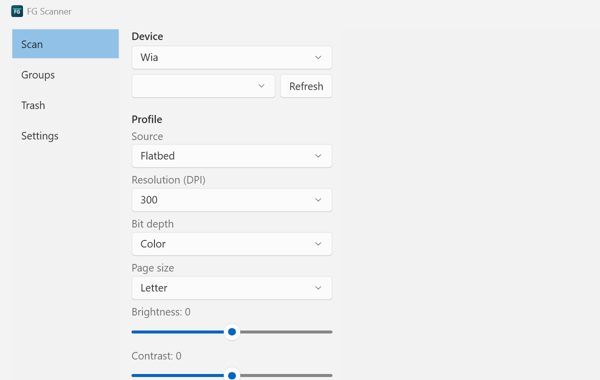

# FG Scanner

Windows desktop scanning with a document-indexing brain. Scan into **Groups**
(a folder = a group), describe every page with your own typed fields, and get
an index in **CSV, Excel, XML, and JSON** — plus OCR to Markdown sidecars,
searchable PDFs, and optional AI page descriptions with your own Gemini key.



## What it does

- **Scan** over WIA, TWAIN (32-bit worker), and eSCL network scanners, with
  batch modes and crash-safe recovery — built on [NAPS2.Sdk](https://www.naps2.com/).
- **Index**: up to 12 typed fields per profile (text/date/number/list, required,
  sticky, defaults with `$(today)`/`$(group)`/… tokens), entered before or after
  scanning in a validating grid; commit writes `index.csv` / `.xlsx` / `.xml` /
  `.json` + `manifest.json` atomically — Excel holding the file open never loses data.
- **Edit**: rotate/deskew/crop/adjust/split/combine, undo/redo, reorder,
  PDF export (PDF/A-1b…3u, metadata, encryption), JPEG/PNG/TIFF/BMP, print, clipboard.
- **OCR**: Tesseract 5.5 shell-out per page → `.md` sidecar with geometric
  Markdown (headings, lists, columns) + a selectable text layer in exported PDFs.
  English bundled; more languages download on demand with checksum verification.
- **AI descriptions** (optional, off by default): Gemini with **your own** API
  key, cost estimate before every run, blank pages skipped locally. See [PRIVACY.md](PRIVACY.md).
- **Retro-process** existing folders of images and PDFs — idempotent, with
  checksum-based rename reconciliation.
- **Trash** with 30-day restore for every deletion; **SQLite database** as a
  first-class asset with stable `v_*` query views ([docs/db-schema.md](docs/db-schema.md)).
- **CLI**: `fgscanner scan|process|export|list-devices` for scheduled tasks — no UI needed.

## Install

Grab the installer (`fgscanner-<version>-win-x64.exe`) or portable ZIP from
[Releases](https://github.com/fgerster1/fgScanner/releases). Windows 10 1607+,
x64. Silent install: `/VERYSILENT /NORESTART`.

> Until code signing is in place (SignPath application pending), SmartScreen
> shows "Windows protected your PC" — choose *More info → Run anyway*, and
> verify the download against `SHA256SUMS.txt` on the release.

## Documentation

- [User guide](docs/user-guide.md)
- [Privacy policy](PRIVACY.md)
- [Database schema (query it yourself)](docs/db-schema.md)
- [Third-party notices](THIRD-PARTY-NOTICES.md)

## Building

```bat
dotnet build                          rem debug build
dotnet test -c Release               rem 220+ tests, no scanner needed
dotnet run --project src/FgScanner.App -- --fake-scanner
```

See [CLAUDE.md](CLAUDE.md) for the architecture map and
[docs/PLAN.md](docs/PLAN.md) for the full specification.

## License

MIT (see [LICENSE](LICENSE)). Scanning uses NAPS2.Sdk (LGPL-2.1), shipped as
separate unmodified assemblies — see [THIRD-PARTY-NOTICES.md](THIRD-PARTY-NOTICES.md).
